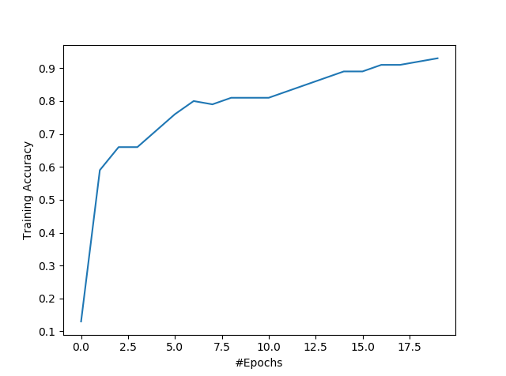
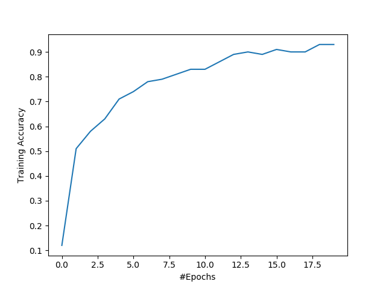
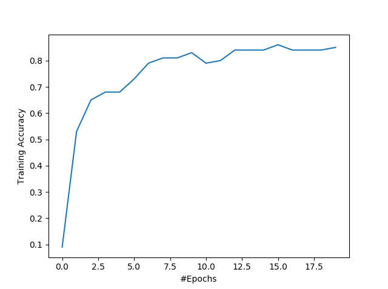
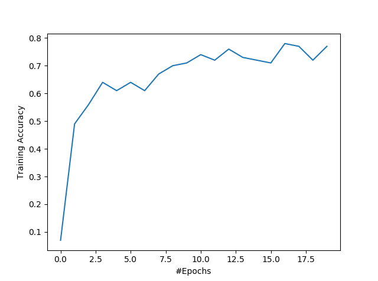

# Gradient Manipulation and Adversarial Images

In this project I continue to explore the mathematical tools on which deep learning is based, while also moving towards real world network architectures. Simple CNNs are trained on the CIFAR-10 and MNIST datasets, and gradient approximation techniques are experimented, that use gradients to create adversarial images.

Data Pre-processing and Augmentation
-------------------------------------

### Network

| Layers | Hyper-parameters |
| ------ | ------ |
Convolution 1 | Kernel size = (5, 5, 32), SAME padding. Followed by BatchNorm and ReLU
Pooling 1 | Average operation. Kernel size = (2, 2). Stride = 2. Padding = 0
Convolution 2 | Kernel size = (5, 5, 32), SAME padding Followed by BatchNorm and ReLU
Pooling 2 | Average operation. Kernel size = (2, 2). Stride = 2. Padding = 0
Convolution 3 | Kernel size = (5, 5, 64), SAME padding Followed by BatchNorm and ReLU
Pooling 3 | Average operation. Kernel size = (2, 2). Stride = 2. Padding = 0
Fully Connected | Output channels = 64. Followed by BatchNorm and ReLU
Fully Connected | Output channels = 10. Followed by Softmax

### Training CIFAR-10 with 10000 and steps of an epoch to 100 (withbatch size 100)

| Raw images | Normalized (μ=0, σ=1) | Previous + Random flip(50%) | Previous + Zero-padded(4) and random cropped(32x32) |
| ------ | ------ | ------ | ------ |
 |   |   |  
Test Accuracy: 0.7053000038862228 | Test Accuracy: 0.7191000002622604 | Test Accuracy: 0.7513000022172928 | Test Accuracy: 0.7681999999284744

Binary networks
----------------

### Network

| Layers | Hyper-parameters |
| ------ | ------ |
Convolution 1 | Kernel size = (3, 3, 32), Padding=1 (SAME), ReLU activation
Convolution 2 | Kernel size = (3, 3, 64), Stride=2, Padding=1, ReLU activation
Convolution 3 | Kernel size = (3, 3, 128), Stride=2, Padding=1, ReLU activation
Convolution 4 | Kernel size = (3, 3, 128), Stride=2, Padding=1, ReLU activation
Convolution 5 | Kernel size = (3, 3, 128), Stride=2, Padding=1, ReLU activation
Fully Connected | Output channels = 100. ReLU activation
Fully Connected | Output channels = 10. Softmax activation

### Training MNIST with 10000 and steps of an epoch to 100 (withbatch size 100)

| ReLU activation | Sign activation with custom gradient |
| ------ | ------ |
 | 
  |  
Test Accuracy:  0.9866000068187714 | Test Accuracy: 0.9819000059366226

Adversarial Images
-------------------

### Adding perturbations and fooling the network to misclassify

| Original prediction | Perturbed prediction |
| ------ | ------ |
  4 |   8
  9 |   4 

### Adding perturbations and forcing the network to believe that the image has a particular label

| Original prediction | Perturbed prediction |
| ------ | ------ |
  0 |   5
  4 |   7 

### Adding perturbations and forcing the network to misclassify using Sign activation

| Original prediction | Perturbed prediction |
| ------ | ------ |
  1 |   4
  2 |   8

References
-----------

* Dr. Jianbo Shi's CIS 680 Lecture Slides
* [CIFAR-10](https://www.cs.toronto.edu/~kriz/cifar.html)
* Y. Bengio, N. L_eonard, and A. Courville. [Estimating or propagating gradients through stochastic neurons for conditional computation](https://arxiv.org/abs/1308.3432)
* I. J. Goodfellow, J. Shlens, and C. Szegedy. [Explaining and harnessing adversarial examples](https://arxiv.org/abs/1412.6572)
* G. Hinton, N. Srivastava, and K. Swersky. Neural networks for machine learning.
* I. Hubara, M. Courbariaux, D. Soudry, R. El-Yaniv, and Y. Bengio. [Binarized neural networks](https://arxiv.org/abs/1602.02830)
In Advances in neural information processing systems, pages 4107-4115, 2016.
* Y. LeCun, C. Cortes, and C. Burges. [MNIST handwritten digit database. AT&T Labs](http://yann.lecun.com/exdb/mnist)
* S.-M. Moosavi-Dezfooli, A. Fawzi, O. Fawzi, and P. Frossard. [Universal adversarial perturbations](https://arxiv.org/abs/1610.08401)
